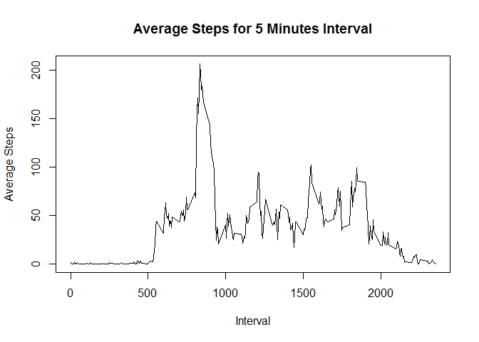
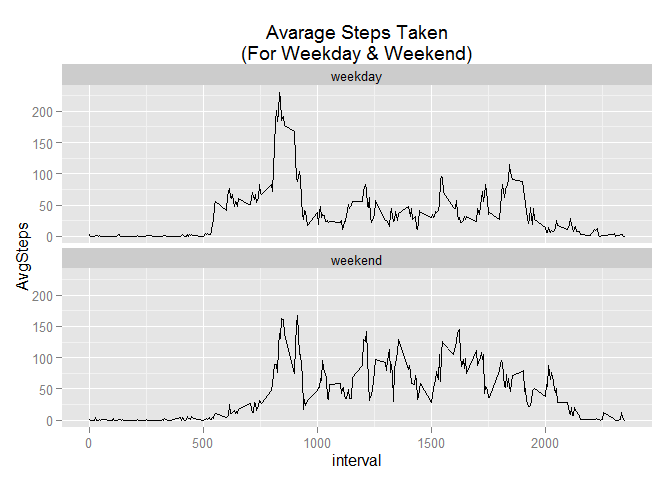

# Reproducible Research: Peer Assessment 1


## Loading and preprocessing the data
Prepare R Environment & load necessary library

```r
library(ggplot2)
library(dplyr)
```

```
## Warning: package 'dplyr' was built under R version 3.2.1
```

```
## 
## Attaching package: 'dplyr'
## 
## The following objects are masked from 'package:stats':
## 
##     filter, lag
## 
## The following objects are masked from 'package:base':
## 
##     intersect, setdiff, setequal, union
```

The source data is loaded into a data frame 'data' for futher analysis

```r
data <- read.csv("activity.csv")
```

Explore the data frame to have a feel of the data

```r
str(data)
```

```
## 'data.frame':	17568 obs. of  3 variables:
##  $ steps   : int  NA NA NA NA NA NA NA NA NA NA ...
##  $ date    : Factor w/ 61 levels "2012-10-01","2012-10-02",..: 1 1 1 1 1 1 1 1 1 1 ...
##  $ interval: int  0 5 10 15 20 25 30 35 40 45 ...
```

```r
summary(data)
```

```
##      steps                date          interval     
##  Min.   :  0.00   2012-10-01:  288   Min.   :   0.0  
##  1st Qu.:  0.00   2012-10-02:  288   1st Qu.: 588.8  
##  Median :  0.00   2012-10-03:  288   Median :1177.5  
##  Mean   : 37.38   2012-10-04:  288   Mean   :1177.5  
##  3rd Qu.: 12.00   2012-10-05:  288   3rd Qu.:1766.2  
##  Max.   :806.00   2012-10-06:  288   Max.   :2355.0  
##  NA's   :2304     (Other)   :15840
```

Convert Date Column to Date Format

```r
data$date <- as.Date(data$date)
```

## What is mean total number of steps taken per day?
Total number of steps per day

```r
StepsPerDay <- data %>% 
                group_by(date) %>% 
                summarise(TotalSteps=sum(steps))

hist(StepsPerDay$TotalSteps, breaks = 10,xlab='Total Steps',main='Histogram of Total Steps Per Day')
```

 

Mean & Median Number of Steps taken

```r
mean(StepsPerDay$TotalSteps, na.rm = TRUE)
```

```
## [1] 10766.19
```

```r
median(StepsPerDay$TotalSteps, na.rm = TRUE)
```

```
## [1] 10765
```

## What is the average daily activity pattern?
Plot of Average Steps for each 5 minutes interval

```r
StepsPerInterval <- data %>% 
                    group_by(interval) %>%
                    summarise(AverageSteps=mean(steps,na.rm=T),TotalSteps=sum(steps,na.rm=T))

with(StepsPerInterval,plot(interval,AverageSteps, type = 'l', xlab='Interval', ylab='Average Steps', main='Average Steps for 5 Minutes Interval'))
```

 
  
Interval with highest number of steps

```r
StepsPerInterval[which.max(StepsPerInterval$TotalSteps),1]
```

```
## Source: local data frame [1 x 1]
## 
##   interval
## 1      835
```

## Imputing missing values
Total Rows with NA

```r
sum(is.na(data$steps))
```

```
## [1] 2304
```
  
Missing Values will be imputed with avarage steps of the same time interval (rounded to the nearest integer)

```r
Impute <- data %>% 
            inner_join(StepsPerInterval,by='interval') %>%
            mutate(NewSteps=ifelse(is.na(steps),round(AverageSteps),steps))
```

New Imputed dataset

```r
Impute <- Impute[,c(2,3,6)]
summary(Impute)
```

```
##       date               interval         NewSteps     
##  Min.   :2012-10-01   Min.   :   0.0   Min.   :  0.00  
##  1st Qu.:2012-10-16   1st Qu.: 588.8   1st Qu.:  0.00  
##  Median :2012-10-31   Median :1177.5   Median :  0.00  
##  Mean   :2012-10-31   Mean   :1177.5   Mean   : 37.38  
##  3rd Qu.:2012-11-15   3rd Qu.:1766.2   3rd Qu.: 27.00  
##  Max.   :2012-11-30   Max.   :2355.0   Max.   :806.00
```

Total Steps per day (Imputed dataset)

```r
ImputePerDay <- Impute %>% 
                group_by(date) %>% 
                summarise(NewTotalSteps=sum(NewSteps))

hist(ImputePerDay$NewTotalSteps, breaks=10, xlab='Total Steps', main='Histogram of Total Steps Per Day (Imputed Dataset)')
```

 

Mean & Median Number of Steps taken (Imputed dataset)

```r
mean(ImputePerDay$NewTotalSteps, na.rm = TRUE)
```

```
## [1] 10765.64
```

```r
median(ImputePerDay$NewTotalSteps, na.rm = TRUE)
```

```
## [1] 10762
```

## Are there differences in activity patterns between weekdays and weekends?
Label the dates with Weekday & Weekend

```r
Impute$Days <- weekdays(Impute$date)
Impute$Days <- ifelse(Impute$Days=='Sunday'|Impute$Days=='Saturday','weekend','weekday')

AvgImpute <- Impute %>% 
                group_by(Days, interval) %>%
                summarise(TotalSteps=sum(NewSteps),AvgSteps=mean(NewSteps))
```

Time Series Plot

```r
ggplot(AvgImpute, aes(interval,AvgSteps)) + geom_line() + facet_wrap(~Days,2,1) + ggtitle("Avarage Steps Taken\n(For Weekday & Weekend)")
```

 
